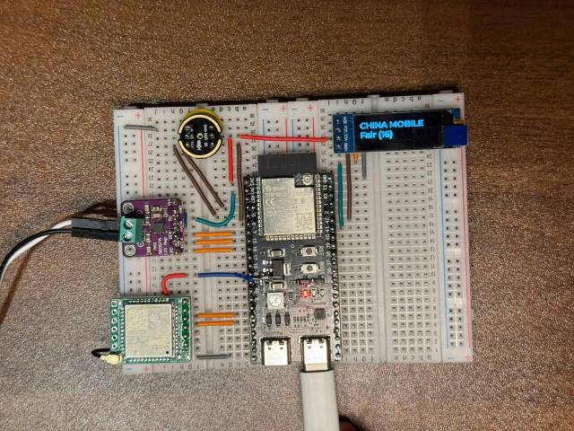

# 千机赋能 AI 智能体

编译前修改如下内容：

- SDK Configuration editor 
-- OTA Version URL ：http://47.113.147.78:9502
-- Connection Type ：Websocket
-- Websocket URL : ws://115.190.27.83
-- Board Type : 立创开发板

- 组件 managed_components\78——esp-ml307\web_socket.cc
-- 93行80改为8082

# squareline UI
- CODEC_I2C_BACKWARD_COMPATIBLE
-- configuration `CODEC_I2C_BACKWARD_COMPATIBLE` in Kconfig to allow use of the old I2C driver.
-- Default is set to `y` for backward compatibility. To use the new I2C driver, set it to `n` instead.
-- y——> old iic ,N——>new iic
-- 因为iic影响 SDK Configuration editor CODEC_I2C_BACKWARD_COMPATIBLE 取消选中
- 要使用开机动画
-- 3rd Party Libraries：GIF decoder library 需要打钩
-- GIF decoder library 打钩会产生#define CONFIG_LV_USE_GIF 1 在"sdkconfig.h"中
-- display.h #define IsGifSwitch CONFIG_LV_USE_GIF
-- IsGifSwitch该宏定义会在setupUi函数和Application类的KaijiGifStart()函数中生效
决定是否执行开机动画
- uiGui
-- 此文件夹并未被编译进工程之中，里面是常用API

<!-- 
# 小智 AI 聊天机器人

这是虾哥的第一个硬件作品。

[ESP32+SenseVoice+Qwen72B打造你的AI聊天伴侣！【bilibili】](https://www.bilibili.com/video/BV11msTenEH3/?share_source=copy_web&vd_source=ee1aafe19d6e60cf22e60a93881faeba)

[手工打造你的 AI 女友，新手入门教程【bilibili】](https://www.bilibili.com/video/BV1XnmFYLEJN/) -->

<!-- ## 项目目的

本项目基于乐鑫的 ESP-IDF 进行开发。

本项目是一个开源项目，主要用于教学目的。我们希望通过这个项目，能够帮助更多人入门 AI 硬件开发,了解如何将当下飞速发展的大语言模型应用到实际的硬件设备中。无论你是对 AI 感兴趣的学生，还是想要探索新技术的开发者，都可以通过这个项目获得宝贵的学习经验。

欢迎所有人参与到项目的开发和改进中来。如果你有任何想法或建议，请随时提出 issue 或加入群聊。

学习交流 QQ 群：946599635 -->

<!-- ## 已实现功能

- Wi-Fi 配网
- 支持 BOOT 键唤醒和打断
- 离线语音唤醒（乐鑫方案）
- 流式语音对话（WebSocket 或 UDP 协议）
- 支持国语、粤语、英语、日语、韩语 5 种语言识别（SenseVoice 方案）
- 声纹识别（识别是谁在喊 AI 的名字，[3D Speaker 项目](https://github.com/modelscope/3D-Speaker)）
- 使用大模型 TTS（火山引擎与 CosyVoice 方案）
- 支持可配置的提示词和音色（自定义角色）
- Qwen2.5 72B 或 豆包 API
- 支持每轮对话后自我总结，生成记忆体
- 扩展液晶显示屏，显示信号强弱
- 支持 ML307 Cat.1 4G 模块 -->

<!-- ## 硬件部分

为方便协作，目前所有硬件资料都放在飞书文档中：

[《小智 AI 聊天机器人百科全书》](https://ccnphfhqs21z.feishu.cn/wiki/F5krwD16viZoF0kKkvDcrZNYnhb?from=from_copylink)

面包板接线图如下：

 -->

<!-- ## 固件部分 -->

<!-- ### 免开发环境烧录

新手第一次操作建议先不要搭建开发环境，直接使用免开发环境烧录的固件。固件使用的是作者友情提供的测试服，目前开放免费使用，请勿用于商业用途。

[Flash烧录固件（无IDF开发环境）](https://ccnphfhqs21z.feishu.cn/wiki/Zpz4wXBtdimBrLk25WdcXzxcnNS)  -->

### 开发环境

- Cursor 或 VSCode
- 安装 ESP-IDF 插件，选择 SDK 版本 5.3 或以上
- Ubuntu 比 Windows 更好，编译速度快，也免去驱动问题的困扰

<!-- ## AI 角色配置

如果你已经拥有一个小智 AI 聊天机器人，可以参考 [后台操作视频教程](https://www.bilibili.com/video/BV1jUCUY2EKM/)

详细的使用说明以及测试服的注意事项，请参考 [小智测试服的帮助说明](https://xiaozhi.me/help)。 -->

